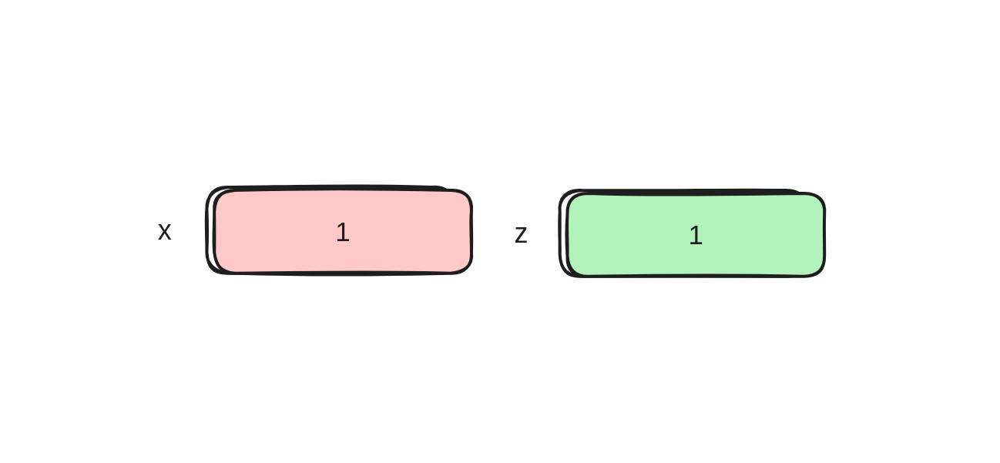
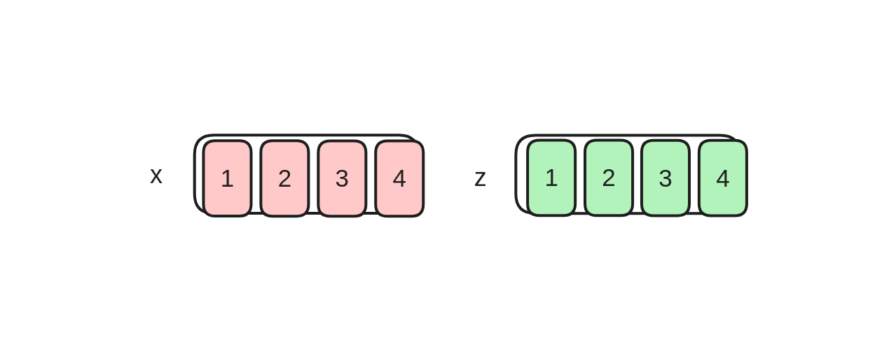
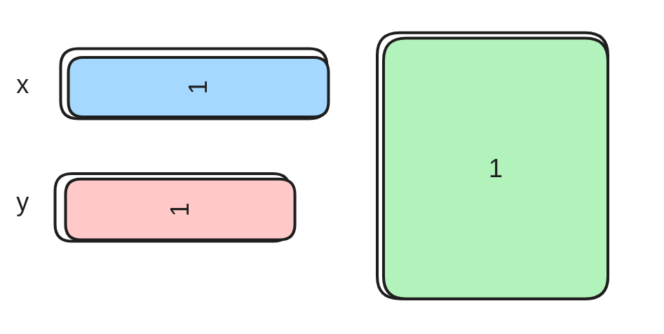
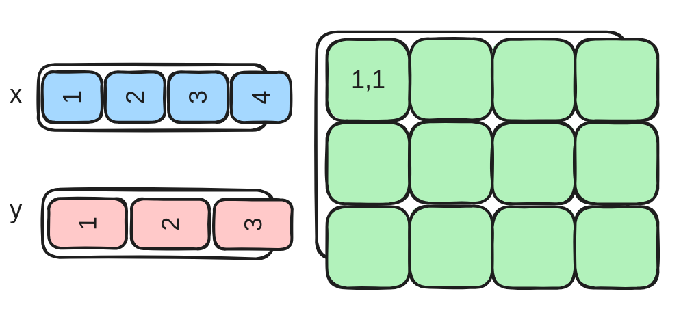
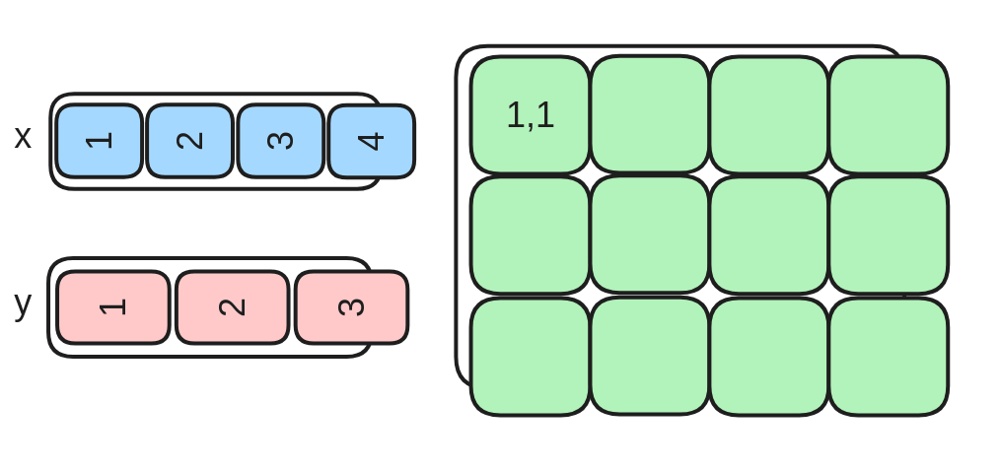
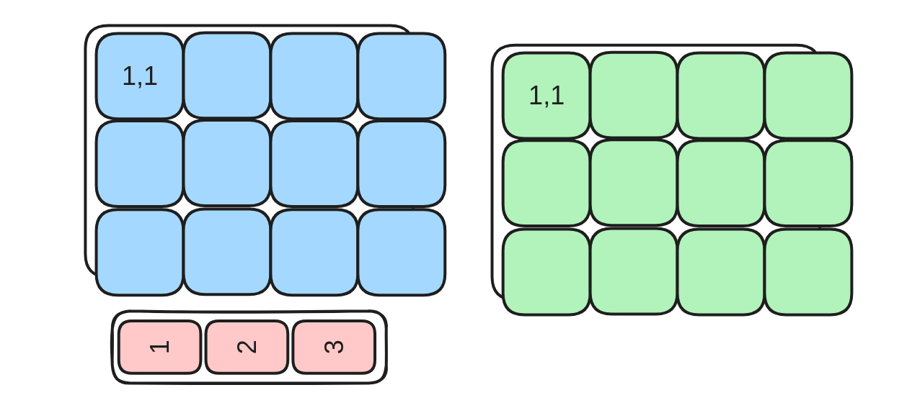
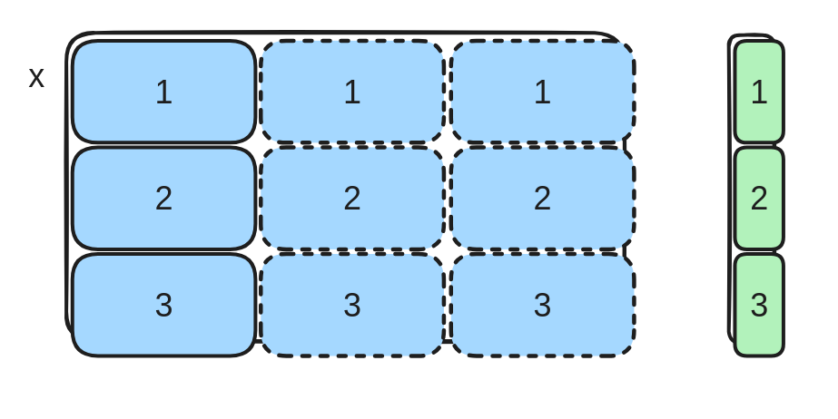
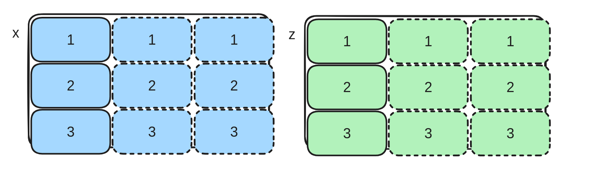
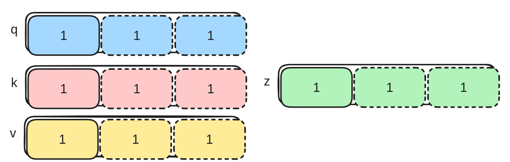

# Homework 1 — Triton Warm‑ups (Oct 04 → Oct 25)

> **Timeline:** three weeks — **Oct 04** to **Oct 25** (inclusive).  
> **Goal:** write Triton kernels that match the reference PyTorch implementations (within floating‑point tolerance) and pass the provided tests.

---

## Contents
- [Tasks](#tasks)
  - [Task 1 — Constant Add](#task-1--constant-add)
  - [Task 2 — Constant Add (Block)](#task-2--constant-add-block)
  - [Task 3 — Outer Vector Add](#task-3--outer-vector-add)
  - [Task 4 — Outer Vector Add (Block)](#task-4--outer-vector-add-block)
  - [Task 5 — Fused Outer Multiplication + ReLU](#task-5--fused-outer-multiplication--relu)
  - [Task 6 — Fused Outer Multiplication: Backward](#task-6--fused-outer-multiplication-backward)
  - [Task 7 — Long Sum](#task-7--long-sum)
  - [Task 8 — Long Softmax](#task-8--long-softmax)
  - [Task 9 — Simple FlashAttention (Scalar)](#task-9--simple-flashattention-scalar)

---

## Tasks

### Task 1 — Constant Add



**Problem:** Add a constant to a vector.  
**Grid:** one program **id** axis.  
**Sizes:** `B0 == N0` (no partial blocks).

```python
def add_torch(x, const_val):
    return x + const_val

def add_triton(x, const_val):
    ...
    # Implement with a single program_id(0) and no masking needed
    # because B0 == N0 for this task.

# Must hold (within tolerance):
assert torch.allclose(add_kernel(x, const_val), add_triton(x, const_val))
```

---

### Task 2 — Constant Add (Block)



**Problem:** Add a constant to a vector.  
**Grid:** one **block** axis (no for‑loops yet).  
**Sizes:** `B0 < N0` — **mask required** on the tail.

```python
def add_torch(x, const_val):
    return x + const_val

def add_triton(x, const_val):
    ...
    # Use program_id(0), compute offsets 
    # mask; masked tl.load/tl.store.

assert torch.allclose(add_kernel(x, const_val), add_triton(x, const_val))
```

---

### Task 3 — Outer Vector Add



**Problem:** Add two vectors to form an outer sum matrix.  
**Grid:** one program **block** axis, but both `B0 == N0` and `B1 == N1` (no masking).

```python
def add_vec_torch(x, y):
    return x[None, :] + y[:, None]  # (N1, N0)

def add_vec_triton(x, y):
    ...
    # Use two BLOCK constexprs and map (row, col) with arange.

assert torch.allclose(add_kernel(x, y), add_triton(x, y))
```

---

### Task 4 — Outer Vector Add (Block)



**Problem:** Add a row vector to a column vector.  
**Grid:** **two program block axes**.  
**Sizes:** `B0 < N0`, `B1 < N1` — masking on both axes.

```python
def add_vec_block_torch(x, y):
    return x[None, :] + y[:, None]  # (N1, N0)

def add_vec_block_triton(x, y):
    ...
    # 2D tile: rows , cols 
    # 2D mask 

assert torch.allclose(add_vec_block_torch(x, y), add_vec_block_triton(x, y))
```

---

### Task 5 — Fused Outer Multiplication + ReLU



**Problem:** Multiply a row vector with a column vector **and** apply ReLU.  
**Grid:** two program block axes.  
**Sizes:** `B0 < N0`, `B1 < N1`.

```python
import torch

def mul_relu_block_torch(x, y):
    return torch.relu(x[None, :] * y[:, None])

def mul_relu_block_triton(x, y):
    ...
    # Compute outer product tile and apply maximum.

assert torch.allclose(mul_relu_block_torch(x, y), mul_relu_block_triton(x, y))
```

---

### Task 6 — Fused Outer Multiplication: Backward



**Problem:** Backward of `z = relu(x * y[:, None])` w.r.t. `x`, given upstream gradient `dz (N1, N0)`.  
**Grid:** two program blocks, `B0 < N0`, `B1 < N1`.

```python
def mul_relu_block_back_torch(x, y, dz):
    x = x.clone().requires_grad_(True)
    y = y.clone().requires_grad_(True)
    z = torch.relu(x * y[:, None])
    z.backward(dz)
    dx = x.grad
    return dx

def mul_relu_block_back_triton(x, y, dz):
    ...
    # Use derivative: d/dx relu(u) = 1[u>0] * d/dx u, with u = x * y_j
    # So dx[i] = sum_j 1[u[i,j] > 0] * y[j] * dz[j,i]

assert torch.allclose(
    mul_relu_block_back_torch(x, y, dz),
    mul_relu_block_back_triton(x, y, dz),
    rtol=1e-4, atol=1e-5
)
```

---

### Task 7 — Long Sum



**Problem:** Sum each **row** of a 2D tensor `x` of shape `(N0, T)`.  
**Grid:** one program block axis over **batches** (`N0`). Process `T` using inner tiles `B1 < T` (loop over tiles).

```python
def sum_torch(x):
    return x.sum(1)  # (N0,)

def sum_triton(x):
    ...
    # For each batch i: accumulate a running sum over tiles of length B1.

assert torch.allclose(sum_torch(x), sum_triton(x))
```

---

### Task 8 — Long Softmax



**Problem:** Row‑wise softmax over logits `x` of shape `(N0, T)`.  
**Grid:** one program block axis over **batches** (`N0`). Process `T` using tiles `B1 < T`.

> **Stability:** compute in the numerically stable form shown below. In Triton prefer `exp2`; use `exp(x) = 2^{x * log2(e)}`.

```python
def softmax_torch(x):
    x_max = x.max(1, keepdim=True)[0]
    x = x - x_max
    x_exp = x.exp()
    return x_exp / x_exp.sum(1, keepdim=True)

def softmax_triton(x):
    ...
    # 1) compute row max and row sum(exp(x - max)) in tiles with masks  
    # 2) normalize each tile with stored max and sum, then store results

assert torch.allclose(softmax_torch(x), softmax_triton(x), rtol=1e-4, atol=1e-6)
```

**Advanced:** You can do it in **2 loops** by simultaneously updating a running sum with renormalization when the running max increases (see the FlashAttention trick below).

---

### Task 9 — Simple FlashAttention (Scalar)



**Problem:** A scalar (single‑head) FlashAttention: given query `q (T,)`, keys `k (T,)`, values `v (T,)`, compute
softmax over `q·k_j` and return the weighted sum of `v`.  
**Grid:** process the sequence in tiles `B1 < T` (a single program can stream all tiles).

This can be done in **1 loop** using the running‑max / renormalization trick from softmax:

```python
def flashatt_torch(q, k, v):
    x = q[:, None] * k[None, :]
    x_max = x.max(1, keepdim=True)[0]
    x = x - x_max
    x_exp = x.exp()
    soft =  x_exp / x_exp.sum(1, keepdim=True)
    return (v[None, :] * soft).sum(1)

def flashatt_triton(q, k, v):
    ...
    # Maintain per-query running (m, l, acc):
    # s_j = q * k_j
    # m_new = max(m, s_j)
    # l    = l * 2**(m - m_new) + 2**(s_j - m_new)
    # acc  = acc * 2**(m - m_new) + v_j * 2**(s_j - m_new)
    # m    = m_new
    # result = acc / l

assert torch.allclose(flashatt_torch(q, k, v), flashatt_triton(q, k, v), rtol=1e-4, atol=1e-5)
```


